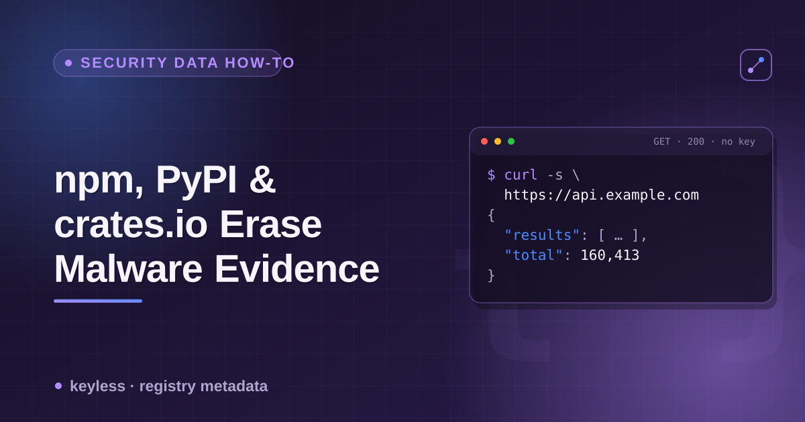

# npm, PyPI & crates.io removed/deprecated/yanked versions — a cheatsheet



All three major package registries expose free, keyless JSON APIs that include some notion of "this version isn't good anymore." None of them use it the same way, and none of them reliably flag the versions that mattered most — the ones pulled after a supply-chain incident. This is the reference for what each field actually contains, checked against four real 2021–2026 incidents.

## The three mechanisms

| Registry | Field | Endpoint | What it actually does |
|---|---|---|---|
| npm | `versions[x].deprecated` | `GET https://registry.npmjs.org/{name}` | A free-text string set per version. Used for genuine CVE nudges and generic "please upgrade" nags — **but a version pulled for an account-takeover/malware incident is usually unpublished entirely, not deprecated**, so it disappears from `versions{}` instead of showing up flagged. |
| PyPI | *(none, at the project level)* | `GET https://pypi.org/pypi/{name}/json` | No per-version deprecation flag at all. A fully-removed project (e.g. after a takeover) returns HTTP 404 for the whole record — no version array, no message beyond `"Not Found"`. |
| crates.io | `yanked` (boolean, per version) | `GET https://index.crates.io/{path}` (sparse index) | The only one of the three with a real "flag, don't delete" mechanism — `cargo` itself warns on yanked versions. But a version pulled outright as malware (not merely yanked by its own maintainer) can still be fully removed from the index rather than left as `yanked: true`. |

## npm: check version history, not just `/latest`

`GET .../{name}/latest` only shows the current version. To see the full picture (and what's silently missing), fetch the whole package document:

```bash
curl -s https://registry.npmjs.org/ua-parser-js | python3 -c "
import json, sys
vs = json.load(sys.stdin)['versions']
print(len(vs), 'versions present')
print(sum(1 for v in vs.values() if v.get('deprecated')), 'carry a deprecated field')
# the Oct 2021 hijack versions — absent, not deprecated:
for v in ['0.7.29', '0.8.0', '1.0.0']:
    print(v, 'present:', v in vs)
"
```

Verified live 2026-09-07: `ua-parser-js` has 94 versions, 65 carry `deprecated` (3 distinct messages — a v2.x-prerelease notice, a ReDoS/CVE-2022-25927 notice, and a generic upgrade nag). The three versions actually hijacked in October 2021 (`0.7.29`, `0.8.0`, `1.0.0`) are not in `versions{}` at all. Same pattern on `node-ipc`: of 76 versions, only 1 carries `deprecated` (unrelated to the March 2022 "peacenotwar" incident); versions `10.1.1`–`10.1.5` — the two malicious releases plus the point fix — are all absent, with the version list jumping straight from `10.1.0` to `11.0.0`.

## PyPI: a 404 on the whole project is itself a signal (sort of)

```bash
curl -s https://pypi.org/pypi/ctx/json
# {"message": "Not Found"}
```

`ctx` was taken over via an expired-domain trick in May 2022 and used to exfiltrate AWS credentials. There's no version-level record to inspect — checking the JSON endpoint for a name you already know about just returns 404, indistinguishable from a name that was never registered. If you're scripting a "was this ever a real package" check, a 404 here is not proof of nonexistence.

## crates.io: read the sparse index, and check for absence, not just `yanked: true`

```bash
# The actual endpoint cargo fetches when resolving dependencies:
curl -s https://index.crates.io/ar/ra/arrayref | python3 -c "
import json, sys
for line in sys.stdin:
    d = json.loads(line)
    print(d['vers'], 'yanked:', d['yanked'])
"
```

Verified live 2026-09-07 against the August 20, 2026 `arrayref` supply-chain attack (RUSTSEC-2026-0260 — the attacker yanked the legitimate `0.3.5`–`0.3.9` to push users toward a malicious `0.3.10`, which was pulled ~86 minutes after publish): 15 version lines, `0.1.0` through `0.3.9`, every one `yanked: false` — the post-incident restore holds. `0.3.10` is not a 16th line with `yanked: true`; it's absent from the index entirely, the same disappearing-version pattern as npm.

## Practical takeaway

None of these three APIs will reliably tell you "this exact version shipped malware" by itself:

- **npm** — check `deprecated` on the full version list (not just `/latest`), but treat a missing version number as equally suspicious as a deprecated one.
- **PyPI** — there's no per-version flag; a 404 on a package you know existed is itself worth investigating.
- **crates.io** — `yanked: true` is the closest thing to an honest audit trail among the three, but a version absent from the index (not present at any `yanked` value) needs the same suspicion as an explicit yank.

For all three, cross-reference a dedicated advisory database (OSV.dev, the GitHub Advisory Database, RustSec) rather than trusting the registry's own metadata alone — this reference is about what the registries themselves expose, not a replacement for real vulnerability data.

This is one input into what my [Package Registry Scraper](https://apify.com/ponderable_hydrometer/package-registry-scraper) actor normalizes into one row per dependency across all three registries. The story behind why I went looking for this is on dev.to: [I Wanted to Check If a Package Had Ever Shipped Malware. npm, PyPI and crates.io All Erased the Evidence.](https://dev.to/ronin13/i-wanted-to-check-if-a-package-had-ever-shipped-malware-npm-pypi-and-cratesio-all-erased-the-43h)
